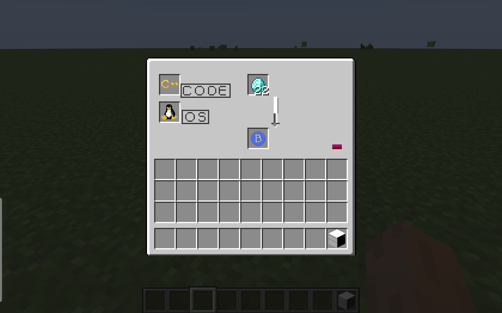

# Sea比特币模组说明文档

- 欢迎使用本模组    
- 模组作者：Seallver （github仓库：https://github.com/Seallver/Minecraft）  
- 模组材质包作者：soulwol （github）

## 版本说明

- 模组版本 2.0  
- 适用的minecraft版本 1.19.2   
- forge版本： 43.2.17

## 安装方法

v2.0的模组zip包里包含了配置好的PCL2，可直接启动；若想在自己的版本中添加模组，可以参考以下教程：

建议使用PCL2启动器，具体安装方法如下：(如果不显示图片请进入“/picture/”安装教程自行查看)

2.0以后的版本还需要一个前置模组，同样需要放入mod文件夹，前置模组放在./前置mod/里了

## 模组介绍

本模组是一个 __科技__ 向的模组

### 玩法说明：
- __比特币__ 是模组中的核心元素，可以与黑客村民交易，换取珍贵的资源

- 比特币的获取方式是通过 __计算机“挖矿”__

- 计算机可以通过合成获得，但挖矿除了需要计算机，还需要一些“软件配置”，包括 __操作系统__ 和 __编程语言__ ，另外需要 __钻石__ 提供能源

- 操作系统和编程语言都可以在 __黑客小屋__ 里找到，另外操作系统也可以通过击杀模组的 __怪物MEMZ__ 概率掉落

- 黑客小屋是自然生成的建筑，但生成概率较低，可以去 __新维度matrix__ 寻找；而且怪物MEMZ会在matrix生成

- 进入matrix的方法是通过手持 __神奇胶囊__ 对着计算机 __shift+右键__，回到主世界也是如此。（蓝色胶囊致敬黑客帝国留在矩阵的桥段）这里需要注意⚠️，你的存档第一次按照上述操作进入matrix时，如果没进去需要退回到标题，然后重新载入存档，再进行上述操作即可，应该是数据包加载有问题，但还未找到修复方法

### 说明:

- 模组中编程语言在比特币挖矿时不会被消耗。

- 编程语言也分等级，C++挖矿效率最高，其次是Go语言，最慢是python

- 操作系统目前只有Win和Linux，虽然实际上OS不太会影响挖矿效率，但在模组中为了划分等级，规定Linux会比win稍微快一些

- win可以通过击杀MEMZ获得，Linux只可以通过黑客小屋得到

- 模组没有电力系统，因此挖矿消耗的能源由钻石提供，越高级的编程语言挖出一个比特币消耗电力越少。

- 电力存在计算机里不会有消耗，但计算机被破坏后其中的电力能源也会消失。

- 黑客村民是村民的新职业，需要在普通村民旁边放置计算机才会让村民变成黑客。

- 出现实验性玩法提示是正常现象，同意即可，若担心存档消失请及时备份

### 模组截图：

合成配方：

黑客小屋：

黑客村民：

交易列表：

创造模式下模组物品栏：

挖矿过程：

新维度：

新怪物MEMZ:

## 工具与参考

开发环境：Forge-43.2.17   
编译器：IntelliJ IDEA Community Edition 2023.3  
开发时参考教程：    
[B站up主 Flandre芙兰](https://space.bilibili.com/4550069)   
[B站up主 奶茶Furieux](https://space.bilibili.com/383290209)  
[材质绘图网站](https://www.pixilart.com/)  
[我的世界开发者中文指南](https://mouse0w0.github.io/MinecraftDeveloperGuide/)  
[Foege官方文档](https://docs.minecraftforge.net/en/latest/)
